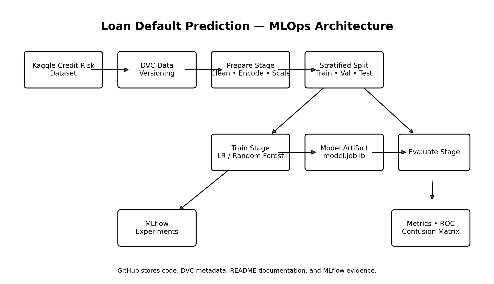
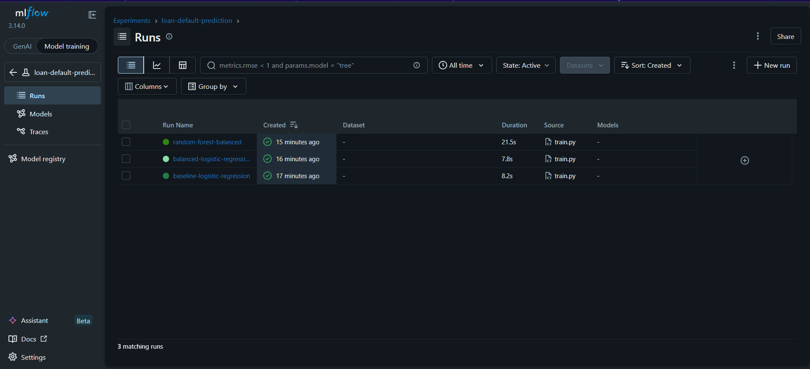
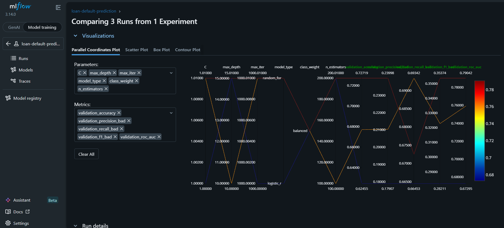
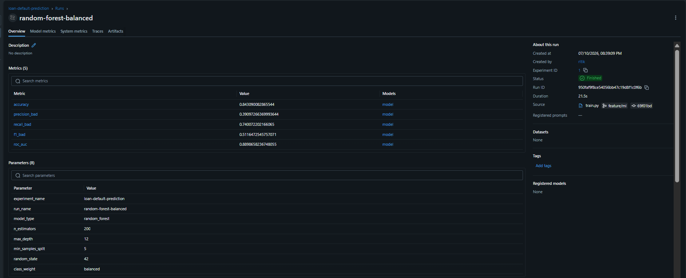
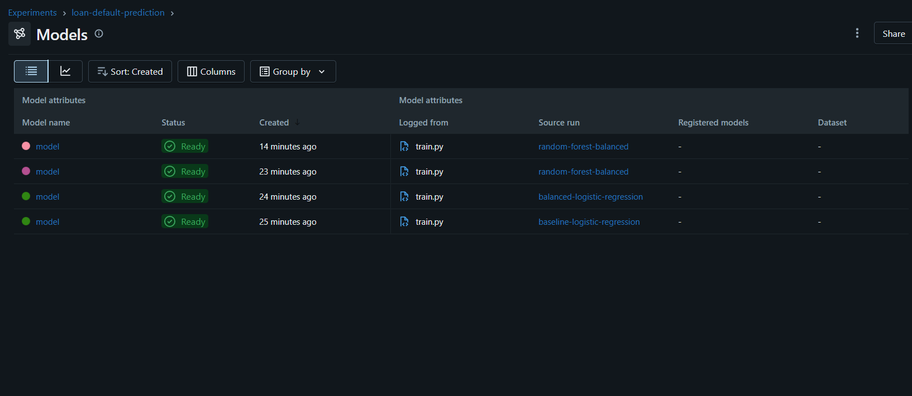
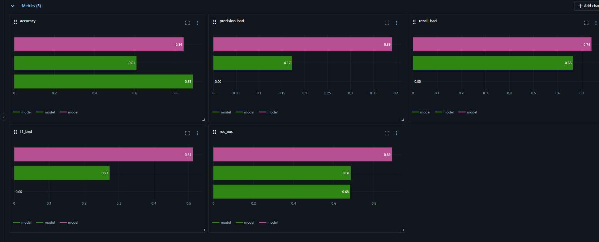
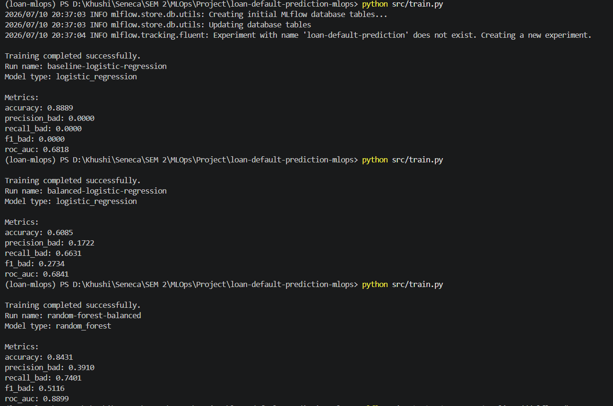

# Loan Default Prediction — MLOps Project

An end-to-end MLOps project for predicting whether a loan is **Good** or **Bad** using a Credit Risk dataset. The project combines **DVC** for data/pipeline versioning, **MLflow** for experiment tracking, and **scikit-learn** for preprocessing and model development.

**GitHub Repository:**
`https://github.com/ritikalal911/loan-default-prediction-mlops`

---

# Part 1 — Dataset Selection and Documentation

## Dataset Overview

**Dataset Name:** Credit Risk Dataset
**Source:** Kaggle Credit Risk Dataset
**Task:** Binary Classification
**Target Variable:** `loan_quality`

The objective is to classify each loan as:

- **Good**
- **Bad**

### Dataset Size

| Item           |            Value |
| -------------- | ---------------: |
| Rows           | **37,408** |
| Columns        |     **10** |
| Target Classes |      **2** |
| Duplicate Rows |      **0** |

---

## Features

| Feature                  | Type        | Description                |
| ------------------------ | ----------- | -------------------------- |
| `account_number`       | Integer     | Unique customer identifier |
| `total_investment`     | Numerical   | Total investment amount    |
| `current_balance`      | Numerical   | Current account balance    |
| `marital_status`       | Categorical | Customer marital status    |
| `gender`               | Categorical | Customer gender            |
| `due_payment`          | Numerical   | Payment due amount         |
| `compensation_charged` | Categorical | Compensation status        |
| `client_type`          | Categorical | Client category            |
| `repay_mode`           | Categorical | Repayment mode             |
| `loan_quality`         | Target      | Good / Bad loan            |

`account_number` is treated as an identifier and is excluded from predictive modeling.

---

## Data Quality Assessment

### Missing Values

| Column                   | Missing Values |
| ------------------------ | -------------: |
| `marital_status`       |              2 |
| `gender`               |              2 |
| `compensation_charged` |              2 |
| `client_type`          |            103 |

Missing categorical values are handled using **most-frequent imputation**.

### Duplicate Records

The dataset contains **0 duplicate rows**.

### Class Distribution

| Class |            Count |       Percentage |
| ----- | ---------------: | ---------------: |
| Good  | **33,254** | **88.90%** |
| Bad   |  **4,154** | **11.10%** |

The dataset is imbalanced, so accuracy alone is not sufficient. The project also evaluates:

- Precision for the Bad class
- Recall for the Bad class
- F1-score for the Bad class
- ROC-AUC

### Outlier Assessment

Numerical variables were reviewed using an **IQR-based outlier check**.

| Numerical Feature    | IQR-Flagged Records |
| -------------------- | ------------------: |
| `total_investment` |               4,680 |
| `current_balance`  |               6,636 |
| `due_payment`      |               5,991 |

These records are retained rather than automatically deleted because large or unusual financial values may still represent valid customers. The purpose of the outlier assessment is therefore to understand the data rather than remove every extreme observation.

---

## Data Preprocessing

The preprocessing stage includes:

1. Removing duplicate rows
2. Removing the identifier column `account_number`
3. Separating features and target
4. Median imputation for numerical variables
5. Most-frequent imputation for categorical variables
6. Standardization of numerical variables using `StandardScaler`
7. One-hot encoding of categorical variables
8. Stratified data splitting to preserve the Good/Bad class ratio

### Train / Validation / Test Strategy

A **stratified split** is used so the target distribution remains consistent across all subsets.

| Dataset        | Purpose                    |
| -------------- | -------------------------- |
| Training Set   | Model fitting              |
| Validation Set | Model/parameter comparison |
| Test Set       | Final unbiased evaluation  |

This separation prevents the final test data from being used during model selection.

---

## Data Versioning with DVC

The raw dataset is versioned using **DVC** rather than committed directly to Git.

```text
data/raw/credit_risk_dataset.csv
        ↓
credit_risk_dataset.csv.dvc
        ↓
GitHub stores the lightweight DVC metadata
```

Example workflow:

```bash
dvc add data/raw/credit_risk_dataset.csv
git add data/raw/credit_risk_dataset.csv.dvc
git commit -m "Track credit risk dataset with DVC"
```

---

# Part 2 — Architecture Design

## System Architecture



The project follows a staged MLOps workflow:

```text
Raw Dataset
    ↓
DVC Versioning
    ↓
Prepare Stage
    ↓
Cleaning + Imputation + Encoding + Scaling
    ↓
Train / Validation / Test Data
    ↓
Train Stage
    ├────────────→ MLflow Experiment Tracking
    ↓
Trained Model
    ↓
Evaluate Stage
    ↓
Metrics + Confusion Matrix + ROC Curve
    ↓
GitHub Documentation / Evidence
```

---

## Technology Stack and Justification

| Technology             | Use                              | Why It Was Chosen                                                                            |
| ---------------------- | -------------------------------- | -------------------------------------------------------------------------------------------- |
| **Python**       | Main development language        | Large machine-learning ecosystem and easy integration with MLOps tools                       |
| **pandas**       | Data loading and manipulation    | Suitable for structured/tabular datasets                                                     |
| **scikit-learn** | Preprocessing and ML models      | Provides preprocessing pipelines, Logistic Regression, Random Forest, and evaluation metrics |
| **DVC**          | Data and pipeline versioning     | Keeps large ML artifacts outside Git while making pipeline stages reproducible               |
| **MLflow**       | Experiment tracking              | Tracks parameters, metrics, models, and experiment history                                   |
| **joblib**       | Model serialization              | Efficient for saving trained scikit-learn models                                             |
| **Matplotlib**   | Model evaluation plots           | Used for ROC curves and confusion matrices                                                   |
| **Git / GitHub** | Source control and documentation | Stores code, configuration, DVC metadata, screenshots, and README documentation              |

---

## Deployment Strategy

### Selected Deployment Type: Batch Prediction

The selected deployment strategy is **batch inference**.

In a practical lending workflow, new customer/loan applications can be collected and scored in scheduled batches using the saved preprocessing pipeline and trained model.

### Why Batch Deployment?

- The current project is focused on offline model development
- Immediate millisecond-level predictions are not required
- Batch scoring is simpler to reproduce and monitor
- DVC can version the data/model used for each prediction cycle
- MLflow can track the model version used for scoring

A future version could expose the trained model through an API if real-time loan decisions are required.

---

# Part 3 — DVC Pipeline Implementation

The machine-learning workflow is defined in:

```text
dvc.yaml
```

The pipeline contains the three required stages:

```text
prepare → train → evaluate
```

---

## Stage 1 — Prepare

```bash
python src/prepare.py
```

The prepare stage performs:

- data loading
- duplicate handling
- identifier removal
- missing-value imputation
- categorical encoding
- numerical scaling
- stratified dataset splitting (70% train/ 15% val/ 15% test)
- creation of processed datasets


---

## Stage 2 — Train

```bash
python src/train.py
```

The training stage:

- loads processed data
- reads model parameters from `params.yaml`
- trains the selected model
- evaluates the model
- saves the trained model
- logs parameters and metrics to MLflow

Model artifact:

```text
models/model.joblib
```

Models used in the experiments:

- Baseline Logistic Regression
- Balanced Logistic Regression
- Random Forest Balanced

---

## Stage 3 — Evaluate

```bash
python src/evaluate.py
```

Evaluation metrics:

- Accuracy
- Precision — Bad
- Recall — Bad
- F1-score — Bad
- ROC-AUC

---

## DVC Remote Storage

A DVC remote is used to store large versioned artifacts such as:

- raw dataset versions
- processed datasets
- trained model artifacts

GitHub stores the source code and lightweight DVC metadata, while the DVC remote stores the actual large artifacts.

Typical commands:

```bash
dvc remote add -d storage <remote-path>
dvc push
```

To restore project artifacts:

```bash
dvc pull
```

---

## Pipeline Reproducibility

The entire ML workflow can be reproduced using:

```bash
dvc repro
```

DVC checks dependencies, parameters, and outputs and reruns only the stages affected by a change.

To view tracked metrics:

```bash
dvc metrics show
```

---

# Part 4 — Experiment Tracking with MLflow

MLflow is used to record and compare model experiments.

**Experiment Name:** `loan-default-prediction`

Three runs were completed:

1. `baseline-logistic-regression`
2. `balanced-logistic-regression`
3. `random-forest-balanced`

---

## MLflow Experiment Runs



The MLflow UI shows all three required runs in the same experiment.

---

## MLflow Run Comparison



The runs were compared using both model parameters and evaluation metrics.

---

## Experiment Results

| Experiment                       |         Accuracy |    Precision Bad |       Recall Bad |           F1 Bad |          ROC-AUC |
| -------------------------------- | ---------------: | ---------------: | ---------------: | ---------------: | ---------------: |
| Baseline Logistic Regression     | **0.8889** |           0.0000 |           0.0000 |           0.0000 |           0.6818 |
| Balanced Logistic Regression     |           0.6085 |           0.1722 |           0.6631 |           0.2734 |           0.6841 |
| **Balanced Random Forest** | **0.8431** | **0.3910** | **0.7401** | **0.5116** | **0.8899** |

---

## Experiment 1 — Baseline Logistic Regression

The first model establishes a baseline.

```text
Accuracy:      0.8889
Precision Bad: 0.0000
Recall Bad:    0.0000
F1 Bad:        0.0000
ROC-AUC:       0.6818
```

The high accuracy is misleading because the model does not correctly identify the minority **Bad** class.

---

## Experiment 2 — Balanced Logistic Regression

The second experiment introduces class balancing.

```text
Accuracy:      0.6085
Precision Bad: 0.1722
Recall Bad:    0.6631
F1 Bad:        0.2734
ROC-AUC:       0.6841
```

Compared with the baseline, recall for the Bad class improves significantly.

---

## Experiment 3 — Balanced Random Forest

The third experiment uses a Random Forest with balanced class weights.

```text
Model:             Random Forest
n_estimators:      200
max_depth:         12
min_samples_split: 5
random_state:      42
class_weight:      balanced
```

Results:

```text
Accuracy:      0.8431
Precision Bad: 0.3910
Recall Bad:    0.7401
F1 Bad:        0.5116
ROC-AUC:       0.8899
```

### Best Run



The **Balanced Random Forest** is selected as the best experiment because it provides the strongest combination of:

- Bad-class recall
- Bad-class F1-score
- ROC-AUC
- useful overall accuracy

---

## MLflow Model Artifacts



MLflow records model artifacts together with their source run.

---

## MLflow Metric Dashboard



The metric comparison shows how the balanced Random Forest improves minority-class detection compared with the baseline.

---

## Training Output



The terminal output provides additional evidence of all three training runs and their metrics.

---

# Class Imbalance Handling

The target distribution is:

```text
Good = 88.90%
Bad  = 11.10%
```

The baseline Logistic Regression does not handle class imbalance and obtains:

```text
Recall Bad = 0.0000
```

The experimental models use:

```python
class_weight="balanced"
```

This increases the importance of the minority Bad class during training without duplicating records.

### Effect of Class Balancing

| Model                        |       Recall Bad |           F1 Bad |
| ---------------------------- | ---------------: | ---------------: |
| Baseline Logistic Regression |           0.0000 |           0.0000 |
| Balanced Logistic Regression |           0.6631 |           0.2734 |
| Balanced Random Forest       | **0.7401** | **0.5116** |

The results show that class balancing greatly improves detection of Bad loans.

---

# Repository Structure

```text
loan-default-prediction-mlops/
│
├── .dvc/
│
├── data/
│   ├── raw/
│   │   └── credit_risk_dataset.csv.dvc
│   └── processed/
│
├── models/
│   └── model.joblib
│
├── reports/
│   ├── architecture_diagram.png
│   ├── dataset_documentation.md
│   ├── metrics.json
│   └── mlflow/
│       ├── 01_all_runs.png
│       ├── 02_compare_runs.png
│       ├── 03_best_run.png
│       ├── 04_model_artifact.png
│       ├── 05_model_metrics.png
│       └── 06_model_training.png
│
├── src/
│   ├── inspect_data.py
│   ├── prepare.py
│   ├── train.py
│   └── evaluate.py
│
├── dvc.yaml
├── dvc.lock
├── params.yaml
├── requirements.txt
└── README.md
```

---

# How to Run the Project

## 1. Clone the Repository

```bash
git clone https://github.com/ritikalal911/loan-default-prediction-mlops.git
cd loan-default-prediction-mlops
```

## 2. Install Dependencies

```bash
pip install -r requirements.txt
```

## 3. Retrieve DVC Data

```bash
dvc pull
```

## 4. Reproduce the Complete Pipeline

```bash
dvc repro
```

## 5. View DVC Metrics

```bash
dvc metrics show
```

## 6. Launch MLflow

```bash
mlflow ui
```

Open the local MLflow URL shown in the terminal.


---

# Conclusion

This project demonstrates a complete MLOps workflow for **loan quality prediction**.

The Credit Risk dataset was documented and assessed for missing values, duplicate records, class imbalance, and numerical outliers. DVC was used to structure the reproducible `prepare → train → evaluate` pipeline, while MLflow was used to track a baseline model and two additional experiments.

The experiment comparison demonstrates that raw accuracy alone is not sufficient for this imbalanced problem. The baseline Logistic Regression achieved high accuracy but failed to identify Bad loans. After applying class balancing, minority-class recall improved substantially.

Among the recorded experiments, the **Balanced Random Forest** produced the strongest overall result with:

- **Accuracy:** 0.8431
- **Precision Bad:** 0.3910
- **Recall Bad:** 0.7401
- **F1 Bad:** 0.5116
- **ROC-AUC:** 0.8899

Therefore, the Balanced Random Forest was selected as the best-performing experiment for this phase of the project.
