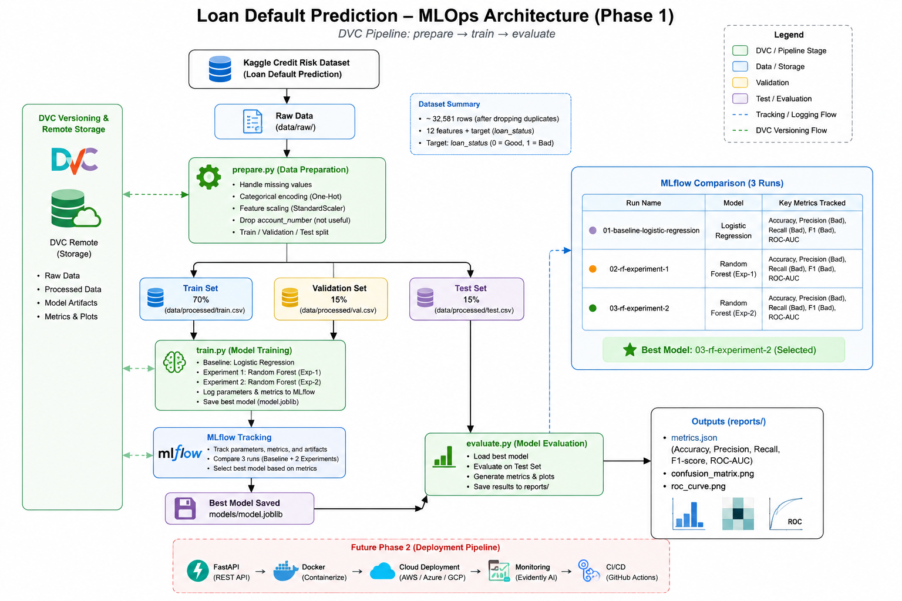
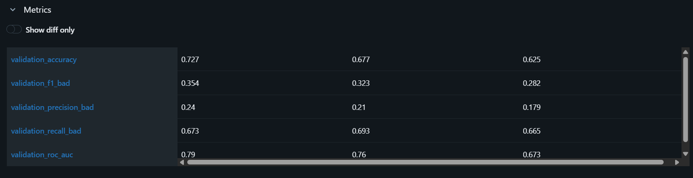
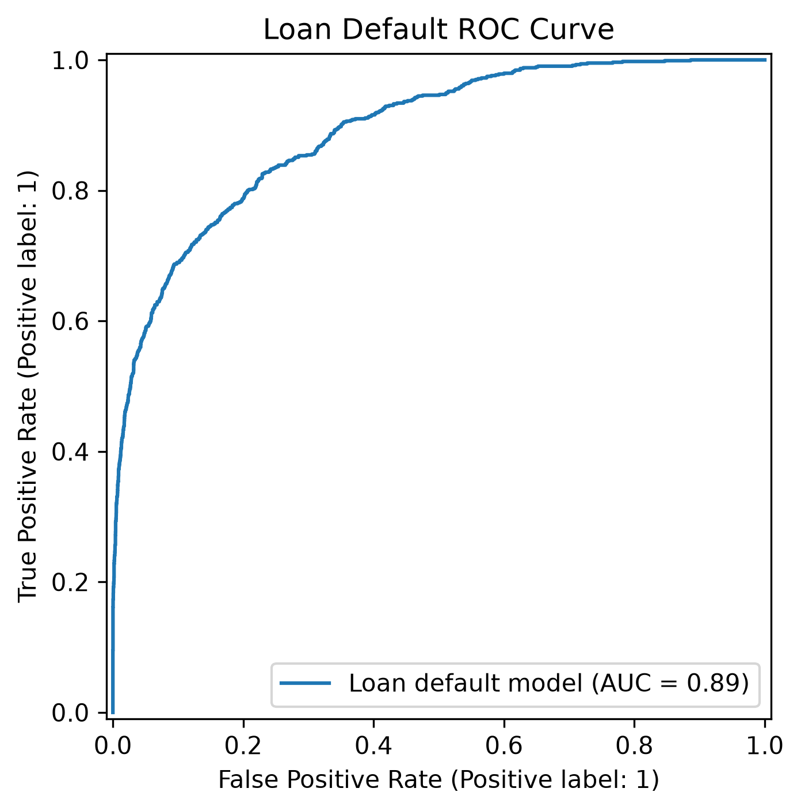

# Loan Default Prediction — MLOps

An end-to-end MLOps project for predicting loan quality as **Good** or **Bad** using financial and demographic customer information.

This repository covers the complete lifecycle from dataset preparation and experiment tracking to cloud deployment, CI/CD, drift monitoring, and conditional model retraining.

## Project Workflow

```text
Raw Dataset
    ↓
DVC Prepare
    ↓
Train / Validation / Test
    ↓
Model Training
    ↓
MLflow Experiment Tracking
    ↓
Selected Random Forest Model
    ↓
Final Test Evaluation
    ↓
FastAPI
    ↓
Docker
    ↓
Render
    ↓
GitHub Actions CI/CD
    ↓
EvidentlyAI Drift Monitoring
    ↓
Conditional Retraining
```

## Documentation

Detailed project documentation is separated by topic:

| Document                                                      | Description                                                                             |
| ------------------------------------------------------------- | --------------------------------------------------------------------------------------- |
| [Dataset Documentation](reports/docs/dataset_documentation.md) | Dataset source, features, quality, outliers, preprocessing, split, and DVC versioning   |
| [Phase 1 Documentation](reports/docs/phase1.md)                | Dataset pipeline, architecture, DVC, MLflow experiments, selected model, and evaluation |
| [Phase 2 Documentation](reports/docs/phase2.md)                | FastAPI, Docker, Render deployment, CI/CD, monitoring, drift detection, and retraining  |
| [Model Card](model_card.md)                                    | Intended use, performance, limitations, fairness considerations, and model lifecycle    |

## Dataset

- **Source:** Kaggle — Credit Risk Dataset v0
- **Rows:** 37,408
- **Columns:** 10
- **Target:** `loan_quality`
- **Classes:** `Good`, `Bad`
- **Predictive variables:** 8
- **Processed model features:** 17

The dataset has a class imbalance:

| Class | Records | Percentage |
| ----- | ------: | ---------: |
| Good  |  33,254 |     88.90% |
| Bad   |   4,154 |     11.10% |

See the [full dataset documentation](reports/docs/dataset_documentation.md).

## Selected Model

The selected Phase 1 model is a **Random Forest Classifier**.

```yaml
n_estimators: 200
max_depth: 15
min_samples_split: 5
random_state: 42
class_weight: balanced
```

Final test performance:

| Metric              | Result |
| ------------------- | -----: |
| Accuracy            | 0.7281 |
| Precision (`Bad`) | 0.2424 |
| Recall (`Bad`)    | 0.6822 |
| F1 (`Bad`)        | 0.3577 |
| ROC-AUC             | 0.7995 |

See [Phase 1 Documentation](reports/docs/phase1.md) for the full DVC and MLflow workflow.

## Public API

The model is deployed as a FastAPI service using Docker and Render.

**API:**
https://loan-default-prediction-mlops-gpz6.onrender.com

**Swagger UI:**
https://loan-default-prediction-mlops-gpz6.onrender.com/docs

**Health endpoint:**
https://loan-default-prediction-mlops-gpz6.onrender.com/health

Available endpoints:

```text
GET  /
GET  /health
POST /predict
```

Example prediction request:

```json
{
  "total_investment": 50000,
  "current_balance": 12000,
  "marital_status": "Married",
  "gender": "Male",
  "due_payment": 2500,
  "compensation_charged": "No",
  "client_type": "Individual",
  "repay_mode": "Monthly"
}
```

## CI/CD

GitHub Actions automatically performs:

```text
Linting
→ Formatting Check
→ Unit Tests
→ Data Validation
→ Docker Build
→ Render Auto-Deploy after successful checks on main
```

Workflow:

```text
.github/workflows/ci-cd.yml
```

## Monitoring & Retraining

EvidentlyAI is used for feature drift monitoring.

Latest demonstration:

| Metric             | Result |
| ------------------ | -----: |
| Monitored features |      8 |
| Drifted features   |      5 |
| Drift share        |  0.625 |
| Threshold          |   0.50 |
| Drift detected     |    Yes |

Detected drift triggers the retraining workflow.

Current vs retrained candidate:

| Metric              |          Current |        Candidate |
| ------------------- | ---------------: | ---------------: |
| Accuracy            | **0.7281** |           0.7274 |
| Precision (`Bad`) |           0.2424 | **0.2485** |
| Recall (`Bad`)    |           0.6822 | **0.7191** |
| F1 (`Bad`)        |           0.3577 | **0.3693** |
| ROC-AUC             |           0.7995 | **0.8078** |

See [Phase 2 Documentation](reports/docs/phase2.md) for the complete monitoring and retraining workflow.

## Project Evidence

The detailed phase documents contain all screenshots. Key project evidence is also shown below.

### Phase 1 Architecture



### MLflow Experiment Comparison



### Final Model Evaluation



### Public API Deployment


### CI/CD


### Monitoring and Retraining


For the complete set of Phase 1 images, see [Phase 1 Documentation](reports/docs/phase1.md).
For the complete deployment, CI/CD, monitoring, and retraining evidence, see [Phase 2 Documentation](reports/docs/phase2.md).

## Repository Structure

```text
loan-default-prediction-mlops/
├── .github/
│   └── workflows/
│       └── ci-cd.yml
├── app/
│   ├── __init__.py
│   ├── main.py
│   └── schemas.py
├── data/
│   ├── processed/
│   └── raw/
├── deployment_artifacts/
├── models/
├── monitoring/
│   ├── drift_detection.py
│   ├── retrain.py
│   └── run_monitoring.py
├── reports/
│   ├── architecture/
│   │   └── phase1_architecture.png
│   ├── cicd/
│   │   ├── 01_github_actions_passed.png
│   │   ├── 02_render_auto_deploy.png
│   │   └── 03_main_passed_checks.png
│   ├── deployment/
│   │   ├── 01_render_deployment.png
│   │   └── 02_public_api_prediction.png
│   ├── docs/
│   │   ├── dataset_documentation.md
│   │   ├── phase1.md
│   │   └── phase2.md
│   ├── figures/
│   │   ├── confusion_matrix.png
│   │   └── roc_curve.png
│   ├── mlflow/
│   │   ├── 01_all_runs.png
│   │   ├── 02_compare_runs.png
│   │   ├── 03_compare_parameters.png
│   │   ├── 04_compare_metrics.png
│   │   ├── 05_best_run.png
│   │   ├── 06_best_run_detail.png
│   │   ├── 07_model_artifact.png
│   │   └── 08_model_training.png
│   └── monitoring/
│       ├── 01_data_drift.png
│       ├── 02_retraining_output.png
│       ├── drift_report.html
│       ├── drift_report.json
│       ├── drift_status.json
│       └── retraining_comparison.json
├── src/
│   ├── prepare.py
│   ├── train.py
│   └── evaluate.py
├── Dockerfile
├── dvc.yaml
├── dvc.lock
├── model_card.md
├── params.yaml
├── requirements.txt
├── requirements-api.txt
├── requirements-dev.txt
├── requirements-monitoring.txt
└── README.md
```

## Reproduce Phase 1

```bash
dvc pull
dvc repro
```

View metrics:

```bash
dvc metrics show
```

Launch MLflow:

```bash
mlflow ui --backend-store-uri sqlite:///mlflow.db
```

## Run the API Locally

```bash
pip install -r requirements-api.txt
uvicorn app.main:app --reload
```

Open:

```text
http://127.0.0.1:8000/docs
```

## Run Monitoring

Install monitoring requirements:

```bash
pip install -r requirements-monitoring.txt
```

Run the complete monitoring workflow:

```bash
python monitoring/run_monitoring.py
```

## Project Status

- Phase 1 — Dataset, architecture, DVC pipeline, MLflow experiments, evaluation: **Complete**
- Phase 2 — API deployment, Docker, CI/CD, monitoring, retraining: **Complete**

For detailed implementation information, use the documentation links at the top of this README.
