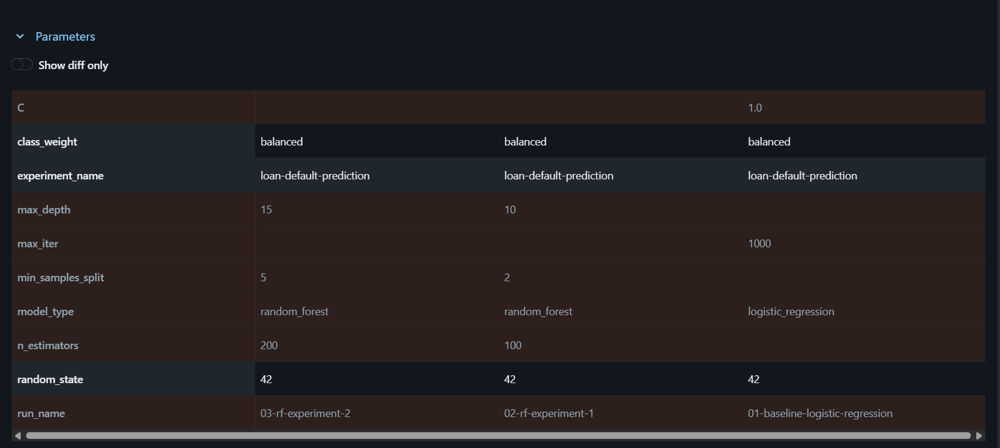
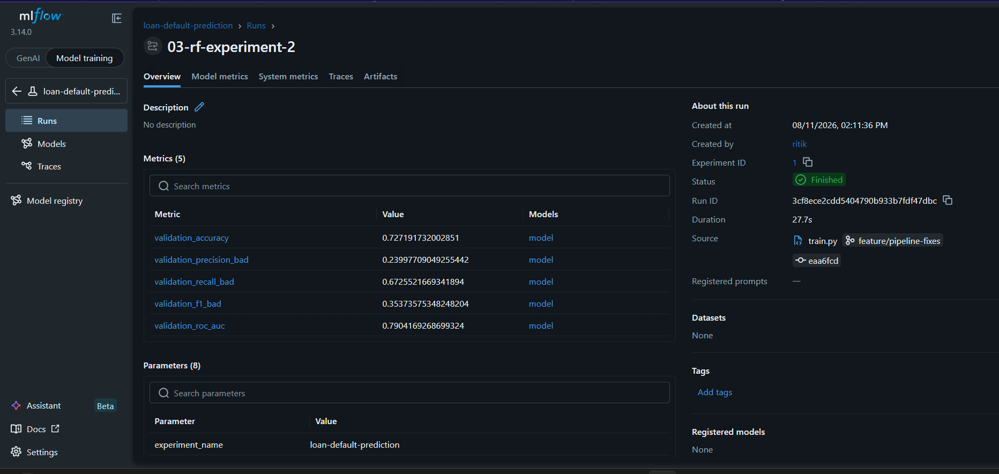
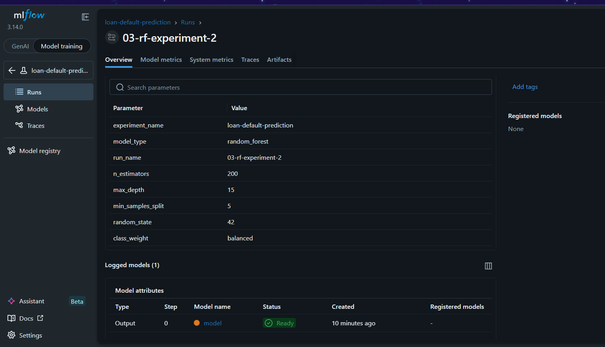
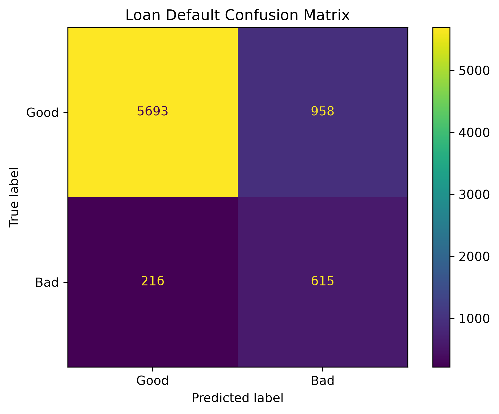

# Loan Default Prediction – MLOps

## Project Overview

This project implements a reproducible MLOps workflow for **Loan Default Prediction**. The system uses customer financial and demographic information to classify loan quality as either **Good** or **Bad**.

Phase 1 focuses on:

- Dataset documentation and quality assessment
- Reproducible preprocessing
- Train/validation/test splitting
- DVC data and model versioning
- A three-stage DVC pipeline
- MLflow experiment tracking
- Baseline and parameterized model experiments
- Final model evaluation

---

## Project Architecture


The Phase 1 DVC workflow is:

```text
prepare → train → evaluate
```

The project keeps the test set separate from training and MLflow model selection.

---

## Dataset

- **Source:** Kaggle – Credit Risk Dataset v0
- **Rows:** 37,408
- **Original columns:** 10
- **Task:** Binary classification
- **Target:** `loan_quality`
- **Classes:** `Good`, `Bad`

Target distribution:

| Class | Records | Percentage |
| ----- | ------: | ---------: |
| Good  |  33,254 |     88.90% |
| Bad   |   4,154 |     11.10% |

The complete dataset analysis is available here:

[Dataset Documentation](reports/docs/dataset_documentation.md)

---

## Data Quality

The dataset contains:

- **0 duplicate rows**
- 2 missing values in `marital_status`
- 2 missing values in `gender`
- 2 missing values in `compensation_charged`
- 103 missing values in `client_type`
- No missing values in the target

Numeric variables were also assessed for potential outliers using the IQR method. Potential financial outliers were retained because unusually large monetary values may still represent valid observations.

Preprocessing includes:

- Median imputation for numeric features
- Most-frequent imputation for categorical features
- One-hot encoding for categorical variables
- Standard scaling for numeric variables
- Removal of the identifier column `account_number`

After preprocessing, the model receives **17 features**.

---

## Data Split

The dataset is split using stratification:

| Split      | Percentage | Records | Purpose                      |
| ---------- | ---------: | ------: | ---------------------------- |
| Train      |        70% |  26,184 | Model training               |
| Validation |        15% |   5,612 | MLflow experiment comparison |
| Test       |        15% |   5,612 | Final evaluation             |

`random_state=42` is used for reproducibility.

---

## Technology Stack

| Technology     | Purpose                             | Justification                                                      |
| -------------- | ----------------------------------- | ------------------------------------------------------------------ |
| Python         | Main development language           | Strong ecosystem for ML and MLOps                                  |
| Pandas / NumPy | Data processing                     | Efficient tabular and numerical operations                         |
| Scikit-learn   | Preprocessing and modeling          | Reproducible pipelines and standard ML algorithms                  |
| DVC            | Data/model versioning and pipelines | Separates large artifacts from Git and enables reproducible stages |
| MLflow         | Experiment tracking                 | Records parameters, metrics, runs, and model artifacts             |
| Git / GitHub   | Source control and collaboration    | Supports feature branches, history, and team integration           |

### Planned Phase 2 Technologies

The Phase 2 deployment path is planned to use:

```text
FastAPI → Docker → Cloud Deployment → Monitoring → CI/CD
```

FastAPI, Docker, EvidentlyAI, and GitHub Actions are shown as future deployment components and are not treated as completed Phase 1 functionality.

---

## Deployment Strategy

The selected deployment strategy is **online inference**.

For Phase 2, a trained model will be exposed through a FastAPI endpoint so that a new applicant record can receive a prediction on demand.

Planned flow:

```text
Client Request
    ↓
FastAPI
    ↓
Preprocessing
    ↓
Selected Model
    ↓
Good / Bad Prediction
```

---

## Repository Structure

```text
.
├── .dvc/
├── data/
│   ├── raw/
│   └── processed/
├── models/
├── reports/
│   ├── architecture/
│   │   └── phase1_architecture.png
│   ├── docs/
│   │   └── dataset_documentation.md
│   ├── figures/
│   │   ├── confusion_matrix.png
│   │   └── roc_curve.png
│   ├── mlflow/
│   │   ├── 01_all_runs.png
│   │   ├── 02_compare_runs.png
│   │   ├── 03_compare_parameters.png
│   │   ├── 04_compare_metrics.png
│   │   ├── 05_best_run.png
│   │   ├── 06_best_run_detail.png
│   │   ├── 07_model_artifact.png
│   │   └── 08_model_training.png
│   └── metrics.json
├── src/
│   ├── prepare.py
│   ├── train.py
│   └── evaluate.py
├── dvc.yaml
├── dvc.lock
├── params.yaml
├── requirements.txt
└── README.md
```

---

## DVC Pipeline

The DVC pipeline contains the three required stages.

### 1. Prepare

```text
src/prepare.py
```

Responsibilities:

- Load the raw dataset
- Validate the target
- Drop `account_number`
- Handle missing values
- Encode categorical variables
- Scale numeric variables
- Create 70/15/15 splits
- Save processed data and preprocessing artifact

### 2. Train

```text
src/train.py
```

Responsibilities:

- Load training and validation data
- Train the selected classification model
- Calculate validation metrics
- Log parameters and metrics to MLflow
- Save the trained model as `models/model.joblib`

### 3. Evaluate

```text
src/evaluate.py
```

Responsibilities:

- Load the selected model
- Evaluate only on the test set
- Calculate final metrics
- Save `reports/metrics.json`
- Generate confusion matrix
- Generate ROC curve

### Pipeline DAG

```text
Raw Dataset
    ↓
 prepare
    ↓
Train / Validation / Test
    ↓
  train
    ↓
Selected Model
    ↓
 evaluate
    ↓
Metrics + Figures
```

Run the complete pipeline with:

```bash
dvc repro
```

View the DAG with:

```bash
dvc dag
```

---

## DVC Remote Storage

A DVC remote named `storage` is configured for DVC-tracked artifacts.

Verify the remote:

```bash
dvc remote list
```

Push artifacts:

```bash
dvc push
```

Check synchronization:

```bash
dvc status -c
```

Pull tracked artifacts when required:

```bash
dvc pull
```

---

## MLflow Experiment Tracking

MLflow is used to track a baseline and two Random Forest experiments.

### Experiment Runs

| Run                                 | Model               | Main Parameters                                                 |
| ----------------------------------- | ------------------- | --------------------------------------------------------------- |
| `01-baseline-logistic-regression` | Logistic Regression | `C=1.0`, `class_weight=balanced`                            |
| `02-rf-experiment-1`              | Random Forest       | `n_estimators=100`, `max_depth=10`, `min_samples_split=2` |
| `03-rf-experiment-2`              | Random Forest       | `n_estimators=200`, `max_depth=15`, `min_samples_split=5` |

All experiments use `random_state=42`.

### Validation Results

| Run                             |         Accuracy |  Precision (Bad) |     Recall (Bad) |         F1 (Bad) |          ROC-AUC |
| ------------------------------- | ---------------: | ---------------: | ---------------: | ---------------: | ---------------: |
| 01 Baseline Logistic Regression |           0.6246 |           0.1791 |           0.6645 |           0.2821 |           0.6729 |
| 02 RF Experiment 1              |           0.6771 |           0.2104 | **0.6934** |           0.3229 |           0.7595 |
| **03 RF Experiment 2**    | **0.7272** | **0.2400** |           0.6726 | **0.3537** | **0.7904** |

Experiment 2 was selected because it achieved the strongest overall validation performance, including the highest accuracy, precision, F1-score, and ROC-AUC. Experiment 1 achieved slightly higher recall for the `Bad` class.

### MLflow Evidence

#### All Runs


#### Run Comparison


#### Parameter Comparison



#### Metric Comparison


#### Best Run



#### Best Run Details



---

## Selected Model

The selected Phase 1 model is:

```text
Random Forest – 03-rf-experiment-2
```

Parameters:

```yaml
n_estimators: 200
max_depth: 15
min_samples_split: 5
random_state: 42
class_weight: balanced
```

The model artifact is saved as:

```text
models/model.joblib
```

---

## Final Test Results

After model selection using validation data, the selected model was evaluated on the untouched test set.

| Metric                   |      Test Result |
| ------------------------ | ---------------: |
| Accuracy                 | **0.7281** |
| Precision (`Bad`)      | **0.2424** |
| Recall (`Bad`)         | **0.6822** |
| F1 (`Bad`)             | **0.3577** |
| ROC-AUC                  | **0.7995** |
| Classification Threshold |             0.50 |

Metrics are saved in:

```text
reports/metrics.json
```

### Confusion Matrix



### ROC Curve


---

## Running the Project

### 1. Clone the Repository

```bash
git clone <repository-url>
cd loan-default-prediction
```

### 2. Create a Python Environment

Example using Conda:

```bash
conda create -n loan-mlops python=3.12 -y
conda activate loan-mlops
```

### 3. Install Dependencies

```bash
pip install -r requirements.txt
```

### 4. Retrieve DVC Artifacts

```bash
dvc pull
```

### 5. Reproduce the Pipeline

```bash
dvc repro
```

### 6. View Metrics

```bash
dvc metrics show
```

### 7. Launch MLflow

```bash
mlflow ui --backend-store-uri sqlite:///mlflow.db
```

Then open:

```text
http://127.0.0.1:5000
```

---

## Phase 1 Deliverables

- [X] GitHub repository
- [X] Dataset documentation
- [X] Data quality assessment
- [X] Train/validation/test split
- [X] DVC dataset versioning
- [X] Architecture diagram
- [X] Technology stack justification
- [X] Deployment strategy
- [X] DVC pipeline with `prepare`, `train`, `evaluate`
- [X] DVC remote configuration
- [X] Reproducible `dvc repro` pipeline
- [X] MLflow baseline
- [X] Two MLflow experiments
- [X] MLflow comparison screenshots
- [X] Final model evaluation

---

## Phase 2 Direction

Phase 2 will extend this workflow with:

- FastAPI inference endpoint
- Docker containerization
- Public cloud deployment
- GitHub Actions CI/CD
- Automated tests and validation
- EvidentlyAI drift detection
- Model retraining
- Model Card
- Final team presentation and live API demo
