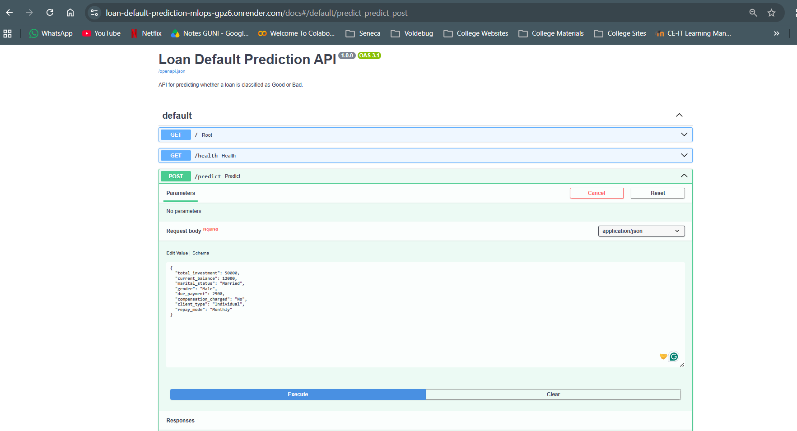
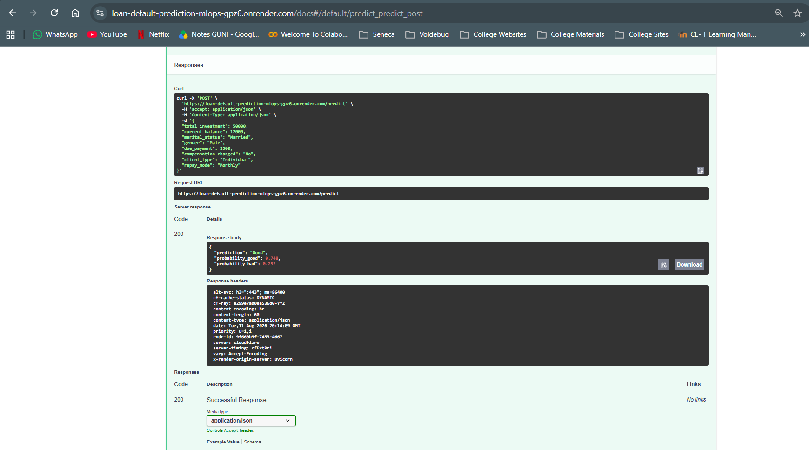
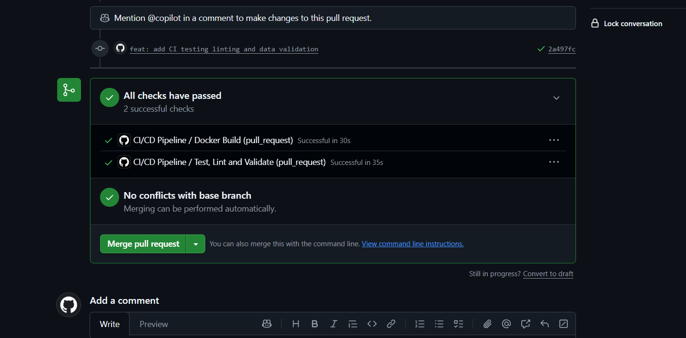
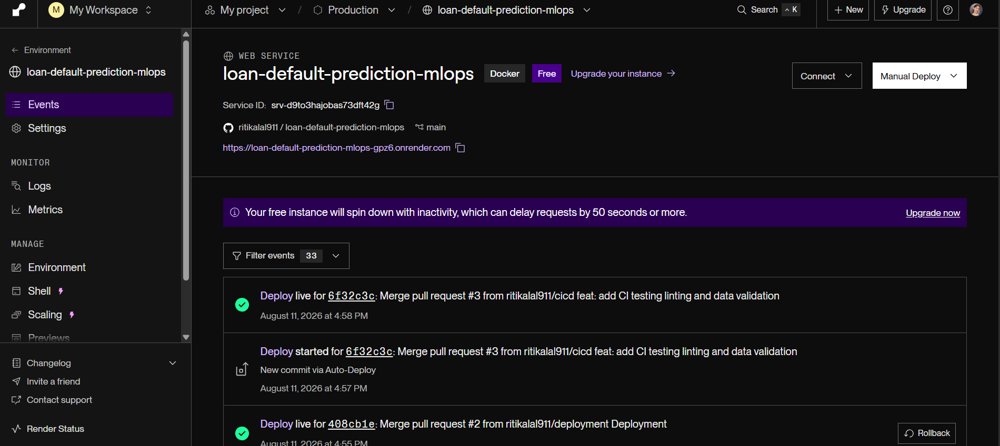
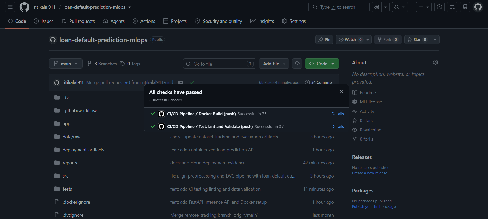
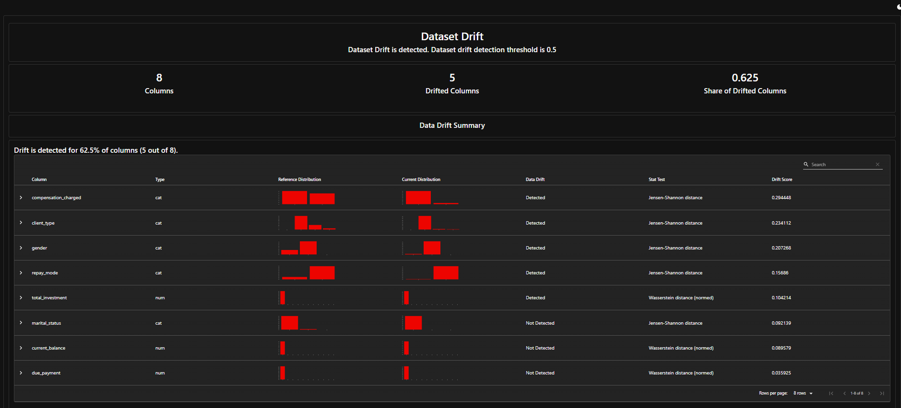
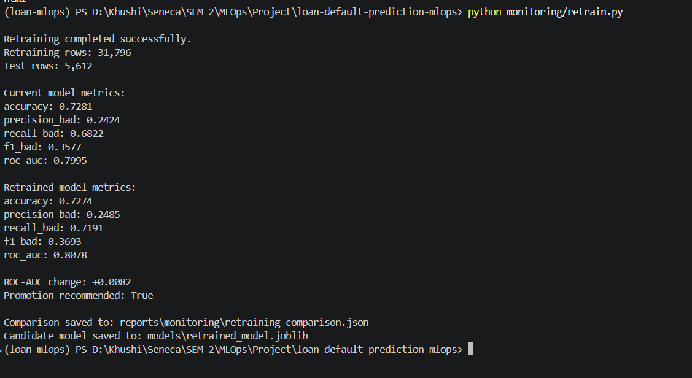

# Phase 2 — Deployment, CI/CD, Monitoring & Retraining

## Overview

Phase 2 extends the Loan Default Prediction project from a reproducible ML pipeline into a deployed and monitored MLOps system.

The Phase 2 workflow is:

```text
Selected Phase 1 Model
        ↓
FastAPI Inference API
        ↓
Docker Container
        ↓
Render Deployment
        ↓
GitHub Actions CI/CD
        ↓
EvidentlyAI Monitoring
        ↓
Drift Detection
        ↓
Conditional Retraining
        ↓
Current vs Candidate Comparison
```

---

## 1. Deployed Model

### FastAPI

The model is exposed through a FastAPI application located in:

```text
app/
├── __init__.py
├── main.py
└── schemas.py
```

The API loads:

```text
models/model.joblib
data/processed/preprocessor.pkl
```

and exposes:

```text
GET  /
GET  /health
POST /predict
```

### Prediction Input

The `/predict` endpoint accepts the eight model input features:

```text
total_investment
current_balance
marital_status
gender
due_payment
compensation_charged
client_type
repay_mode
```

Example request:

```json
{
  "total_investment": 50000,
  "current_balance": 12000,
  "marital_status": "Married",
  "gender": "Male",
  "due_payment": 2500,
  "compensation_charged": "No",
  "client_type": "Individual",
  "repay_mode": "Monthly"
}
```

Example response:

```json
{
  "prediction": "Good",
  "probability_good": 0.748,
  "probability_bad": 0.252
}
```

---

## 2. Docker Containerization

The API is containerized using the root `Dockerfile`.

Build locally:

```bash
docker build -t loan-default-api .
```

Run locally:

```bash
docker run --rm -p 8000:8000 loan-default-api
```

Swagger UI is then available at:

```text
http://127.0.0.1:8000/docs
```

The Docker image includes only the runtime application and frozen deployment artifacts needed for inference.

---

## 3. Public Cloud Deployment

The Dockerized API is deployed on **Render**.

### Public API URL

https://loan-default-prediction-mlops-gpz6.onrender.com

### Swagger Documentation

https://loan-default-prediction-mlops-gpz6.onrender.com/docs

### Health Endpoint

https://loan-default-prediction-mlops-gpz6.onrender.com/health

The Render service is connected to the `main` branch and automatically deploys after successful CI checks.

> The free Render service may take additional time to respond after a period of inactivity.

---

## Deployment Evidence

### Render Deployment



### Public API Prediction



## 4. CI/CD Pipeline

The GitHub Actions workflow is stored at:

```text
.github/workflows/ci-cd.yml
```

The CI/CD flow is:

```text
Pull Request / Push
        ↓
Checkout Repository
        ↓
Set Up Python
        ↓
Install Dependencies
        ↓
Ruff Linting
        ↓
Ruff Formatting Check
        ↓
Unit Tests
        ↓
Data Validation
        ↓
Docker Build Validation
        ↓
Merge to main
        ↓
GitHub Actions on main
        ↓
Render Auto-Deploy
```

### Automated Tests

Tests are stored in:

```text
tests/
├── test_api.py
├── test_data_validation.py
└── data/
    └── sample_input.csv
```

The test suite checks:

- root endpoint,
- health endpoint,
- successful prediction,
- invalid API request handling,
- required input columns,
- missing values,
- numeric feature validity,
- sample data availability.

Local validation completed with **8 passing tests**.

### Linting and Formatting

Ruff is used for both code-quality checks:

```bash
ruff check app tests
ruff format --check app tests
```

### CI/CD Evidence

Screenshots of successful GitHub Actions and Render auto-deployment are stored in:

```text
../cicd/
```

---

### CI/CD Screenshots

#### GitHub Actions Passed



#### Render Automatic Deployment



#### Main Branch Checks Passed



## 5. Monitoring with EvidentlyAI

Monitoring is implemented with EvidentlyAI.

The monitoring code is stored in:

```text
monitoring/
├── drift_detection.py
├── retrain.py
└── run_monitoring.py
```

The workflow compares a reference dataset with a simulated current production batch.

The current batch is intentionally shifted for the academic demonstration because long-term real production traffic is not yet available.

### Drift Result

| Metric                 | Result |
| ---------------------- | -----: |
| Monitored columns      |      8 |
| Drifted columns        |      5 |
| Drift share            |  0.625 |
| Drift threshold        |   0.50 |
| Dataset drift detected |    Yes |

The monitoring decision is:

```text
0.625 >= 0.50
        ↓
Dataset Drift Detected
        ↓
Retraining Triggered
```

### Drift Reports

Generated monitoring artifacts:

```text
../monitoring/drift_report.html
../monitoring/drift_report.json
../monitoring/drift_status.json
```

Run drift detection directly:

```bash
python monitoring/drift_detection.py
```

---

### Monitoring Evidence

#### EvidentlyAI Data Drift Report



## 6. Automated Retraining

The complete monitoring workflow can be run with:

```bash
python monitoring/run_monitoring.py
```

The sequence is:

```text
Run Drift Detection
        ↓
Read Drift Status
        ↓
Compare Drift Share with Threshold
        ↓
If Drift Detected
        ↓
Run retrain.py
        ↓
Train Candidate Model
        ↓
Compare Current and Candidate Models
```

The retraining process combines the original training and validation datasets while keeping the original test dataset unchanged.

```text
Retraining rows: 31,796
Test rows: 5,612
```

---

## 7. Current vs Retrained Model

| Metric              |    Current Model | Retrained Candidate |
| ------------------- | ---------------: | ------------------: |
| Accuracy            | **0.7281** |              0.7274 |
| Precision (`Bad`) |           0.2424 |    **0.2485** |
| Recall (`Bad`)    |           0.6822 |    **0.7191** |
| F1 (`Bad`)        |           0.3577 |    **0.3693** |
| ROC-AUC             |           0.7995 |    **0.8078** |

ROC-AUC change:

```text
+0.0082
```

Promotion recommendation:

```text
True
```

The candidate improved ROC-AUC, precision, recall, and F1 for the `Bad` class. Accuracy decreased slightly, so the candidate is not described as better on every metric.

The comparison is stored in:

```text
../monitoring/retraining_comparison.json
```

The candidate model is saved separately as:

```text
models/retrained_model.joblib
```

The current production model is not automatically overwritten.

---

### Retraining Evidence



The machine-readable retraining comparison is stored at:

```text
../monitoring/retraining_comparison.json
```

## 8. Model Card

The project includes a dedicated model card documenting:

- intended use,
- model configuration,
- dataset and preprocessing,
- evaluation metrics,
- deployment,
- monitoring,
- retraining,
- limitations,
- fairness and ethical considerations.

See:

[Model Card](../../model_card.md)

---

## 9. Phase 2 Deliverables

- [X] GitHub repository URL
- [X] Deployed public API
- [X] FastAPI inference endpoint
- [X] Docker containerization
- [X] GitHub Actions workflow
- [X] Linting and formatting checks
- [X] Unit tests
- [X] Data validation in CI
- [X] Automatic deployment after successful checks on `main`
- [X] EvidentlyAI drift detection
- [X] Drift reports
- [X] Drift-triggered retraining
- [X] Current vs retrained model comparison
- [X] `model_card.md`

---

## 10. Phase 2 Summary

Phase 2 converts the Phase 1 model pipeline into a deployable and monitored MLOps application.

The implemented system now provides:

```text
Public API
+ Docker Deployment
+ Automated CI/CD
+ Automated Tests
+ Data Validation
+ Drift Monitoring
+ Conditional Retraining
+ Candidate Model Comparison
```

The remaining final-delivery task is the team presentation and live API demonstration.
